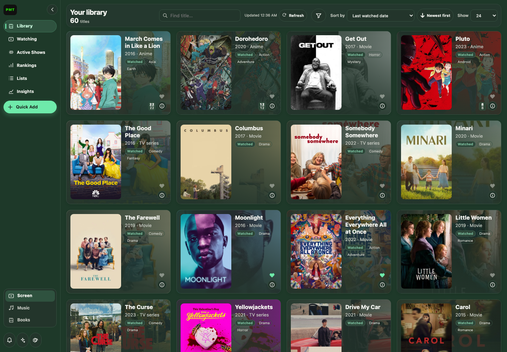
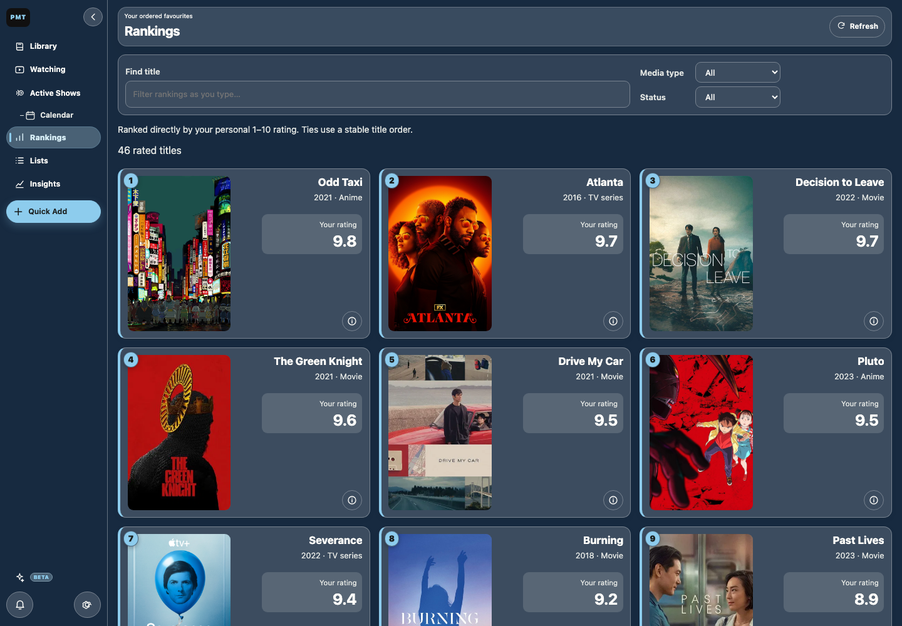
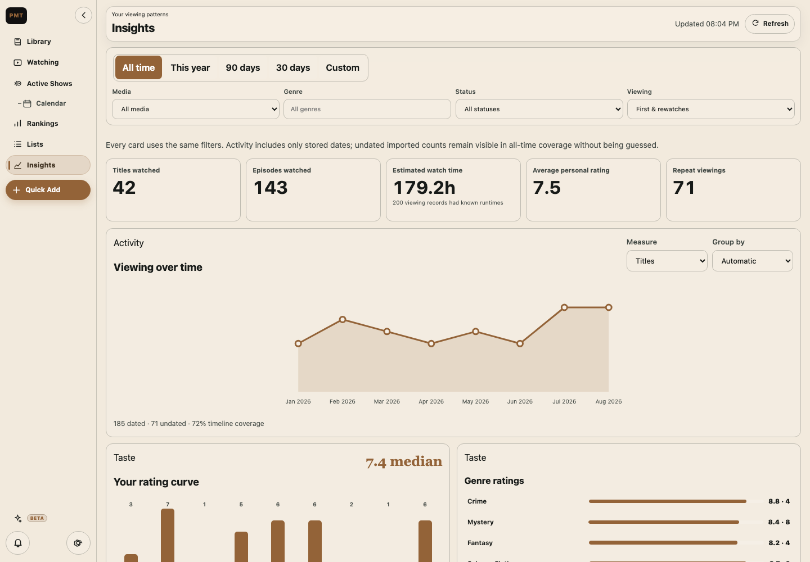
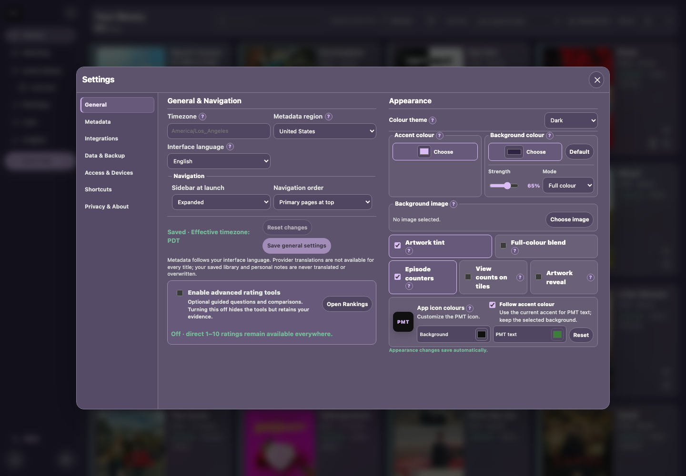
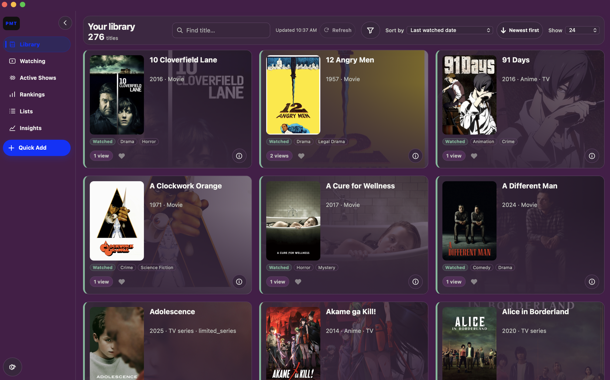
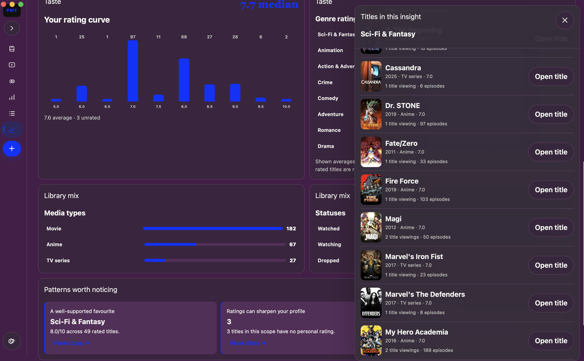
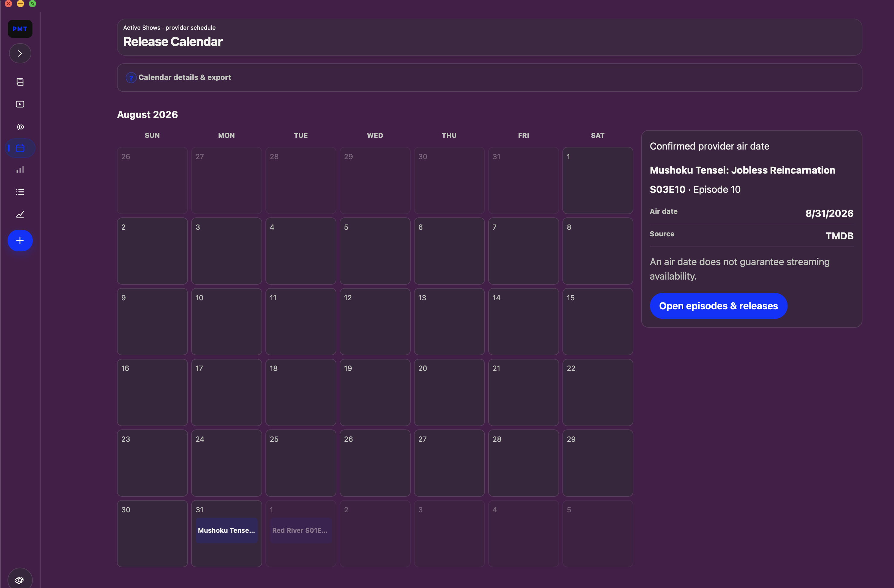

# Personal Media Tracker

[](https://github.com/ASVPATM/personal-media-tracker/actions/workflows/ci.yml)
[](https://github.com/ASVPATM/personal-media-tracker/releases/latest)
[](LICENSE)

A private, local-first home for your movies, television, limited series, and anime.

<p>
  
  
  
  
  
</p>

[Download the latest release](https://github.com/ASVPATM/personal-media-tracker/releases/latest)
or [run it from source](#run-from-source).

## TL;DR

Personal Media Tracker keeps your library, ratings, watch history, episode progress,
rewatches, and viewing insights on your own computer. It needs no PMT account, ads,
telemetry, or required cloud service. Metadata search works without keys for TV and
anime; an optional TMDb token improves movie coverage and adds another series source.



## What you can do

- 🟩 **Library** — track movies, TV, anime, ratings, dates, notes, tags, and favorites.
- 🟦 **Episodes** — follow series, record progress, and view announced air dates.
- 🟪 **Insights** — explore ratings, genres, viewing patterns, and rewatches.
- 🟧 **Portable data** — import, export, back up, and use Obsidian Markdown.
- 🟨 **Personalization** — customize colours, artwork, navigation, and language.
- 🟫 **PMT Server Beta** — add private household accounts and shared lists.

## What it looks like

### Rankings

Rank directly from your personal scores. Optional refinement adds explainable evidence
without silently replacing those scores.



### Insights

All charts use the same visible filters and distinguish known viewing dates from imported
counts whose dates are unknown.



### Make it yours

Appearance changes save automatically. Theme, accent, background strength, background
mode, optional workspace art, subtle or full-colour poster blends, and PMT icon colours
can be combined freely.



## Install a packaged release

Open the [latest GitHub release](https://github.com/ASVPATM/personal-media-tracker/releases/latest)
and download the package for your computer.

> 🟢 **Recommended:** account-free local desktop. · 🟠 **Optional:** PMT Server Beta.

| Platform | Package | Install |
| --- | --- | --- |
| macOS | Apple Silicon DMG or ZIP | Open it and move **Personal Media Tracker** to Applications. |
| Windows | x64 ZIP | Extract it and open `Personal Media Tracker.exe`. |
| Linux | x64 archive | Extract it and run `install-linux.sh`, or launch the included executable. |

Check the release notes for signing/notarization status and compare downloads with the
published `SHA256SUMS.txt`. A supported signed macOS installation can download a verified
update inside the app after **Settings → Privacy & About → Check for updates**; other
installs open the release page.

## First setup

1. Start with the built-in keyless providers or add an optional TMDb read-access token.
2. Search for a first title, add one manually, or preview an import.
3. Review **Settings → Data & Backup**, create a backup, and note the displayed data
   location before importing a large history.

TVmaze supplies keyless TV search and schedules. Jikan and Kitsu supply keyless anime
metadata. TMDb improves movie/TV coverage, artwork, and series identity matching when
configured. Ambiguous or contradictory results stay available for manual review rather
than being guessed. See [Metadata providers](docs/METADATA.md) for exact behavior.

## Run from source

Python 3.11 or newer is required.

```bash
git clone https://github.com/ASVPATM/personal-media-tracker.git
cd personal-media-tracker
python3 -m venv .venv
source .venv/bin/activate
python -m pip install -e .
personal-media-tracker --browser
```

Browser mode still runs PMT locally. For the native desktop window, install the desktop
extra and launch without `--browser`:

```bash
python -m pip install -e ".[desktop]"
personal-media-tracker
```

On Windows PowerShell, activate with `.venv\Scripts\Activate.ps1`.

For an always-on household host, download the version-matched **PMT Server Setup Beta
ZIP**. This optional server component is beta; the normal local desktop library does not
require it. On a Mac, double-click **Install PMT Server Beta**; the guided installer checks Docker,
discovers Tailscale, generates private secrets, starts the server, and opens first-time
setup. SQLite is the recommended default; PostgreSQL is an optional advanced choice.
The normal desktop package never turns into the server console. In **Access & Devices**,
paste a one-time invitation from the standalone server, create a regular account, and let
the operating-system credential vault remember the revocable device session.

For simpler one-person access, **Personal Tailscale access** can share the current local
library with another device in the same private tailnet while the desktop app remains open.
That path is account-free and gives full edit access to anyone permitted to reach the link;
it is separate from PMT Server and never enables public Tailscale Funnel.
Read [PMT Server and shared access](docs/SELF_HOSTING.md) before exposing it to a network.

### More interface previews

#### 🟩 Artwork-rich library

Browse your collection with full-colour artwork tiles.



#### 🟪 Interactive insight details

Open any insight to see the titles behind it.



#### 🟦 Release calendar

Track confirmed episode air dates in a monthly calendar.



## Privacy, data, and recovery

The default app binds only to your computer and stores its database locally. It has no
telemetry or central PMT account. Provider searches contact only the relevant metadata
services. Shared access is opt-in and should not be enabled until its security guide is
understood.

Use **Settings → Data & Backup** to reveal the active data folder, create an online SQLite
backup, export a portable Everything archive, or validate a restore. Do not synchronize
the live SQLite file through iCloud Drive, Dropbox, Syncthing, NFS, or SMB; move verified
backup archives instead.

## Documentation

- [Technical guide](docs/TECHNICAL_GUIDE.md) — architecture, storage, developer setup,
  imports, and recovery.
- [Shared-access guide](docs/SELF_HOSTING.md) — optional authenticated remote access.
- [iOS implementation guide](docs/IOS_APP_IMPLEMENTATION_GUIDE.md) — detailed native-app
  preparation through an on-device preview and later TestFlight path.
- [Server, recommendations, and integrations plan](docs/MULTI_USER_SERVER_AND_INTEGRATIONS_PLAN.md)
  — staged multi-user, deployment, recommendation, notification, and provider architecture.
- [Migration guide](MIGRATING.md) — safely move or restore an existing library.
- [Building releases](BUILDING.md) — desktop packaging commands and artifacts.
- [Changelog](CHANGELOG.md), [support](SUPPORT.md), [privacy](PRIVACY.md), and
  [security policy](SECURITY.md).

## Development checks

```bash
uv sync --locked --extra dev --extra browser
uv run ruff check .
uv run ruff format --check .
uv run pytest
```

## Attribution and license

This product uses the TMDB API but is not endorsed or certified by TMDB. Anime metadata
may come from Jikan/MyAnimeList or Kitsu, TV data from TVmaze under CC BY-SA, and limited
identity data from Wikidata under CC0. Artwork and provider data remain subject to their
respective terms.

Personal Media Tracker is an original project by
[ASVPATM](https://github.com/ASVPATM), released under the [MIT License](LICENSE).
