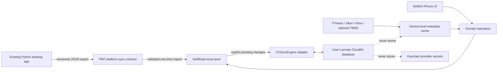

# Personal Media Tracker iOS implementation guide

Status: technical implementation plan, prepared 2026-08-25

Repository baseline: Personal Media Tracker 2.5.2

Observed local toolchain: Xcode 26.6 (`17F113`) at
`/Applications/Xcode.app/Contents/Developer`

This guide is written for the current Personal Media Tracker repository. It is not a
generic SwiftUI tutorial. It treats the existing Python/FastAPI/SQLite application as a
stable desktop product, preserves its local-first and account-free identity, and builds a
native Apple client without making normal desktop releases depend on Xcode or CloudKit.

## 1. The recommended architecture

Create a native SwiftUI iPhone application under an isolated `apple/` directory in this
repository. Use SwiftData for the iPhone's local database, but do **not** point SwiftData
directly at CloudKit. Instead, use `CKSyncEngine` as a deliberate adapter between a local
SwiftData repository and a private CloudKit database.



This is the preferred design for PMT for five reasons:

1. The existing `src/watchtracker/services/sync_contract.py` already defines a
   provider-neutral, record-oriented boundary. `CKSyncEngine` works naturally with that
   boundary.
2. User-owned records, replaceable metadata caches, integration runtime state, and
   credentials already have different portability rules. An explicit adapter can enforce
   those rules record by record.
3. PMT still needs complete deletion tombstones and defined conflict behavior before live
   cross-device writes are safe. `CKSyncEngine` leaves that policy under PMT's control.
4. The Python desktop application cannot safely share or synchronize its live SQLite file
   with an iPhone. JSON records are the interchange format; SQLite remains an
   implementation detail on each platform.
5. The Apple code, signing, and release workflow remain isolated from the existing
   `.github/workflows/release.yml` desktop matrix.

Apple recommends `NSPersistentCloudKitContainer` when an app does not need granular sync
control and `CKSyncEngine` when an app wants to retain control while the system schedules
fetches and sends. PMT falls into the second category because it has provider-cache
exclusions, idempotent imports, soft deletion, and application-specific conflicts. See
[Apple's CloudKit selection guidance](https://developer.apple.com/documentation/cloudkit/deciding-whether-cloudkit-is-right-for-your-app)
and [`CKSyncEngine`](https://developer.apple.com/documentation/cloudkit/cksyncengine-5sie5).

### What not to do

- Do not embed Python, FastAPI, pywebview, or the desktop SQLite database in the iOS app.
- Do not put `watchtracker.sqlite3` in iCloud Drive. SQLite WAL files and two independent
  writers make file synchronization unsafe.
- Do not make the iPhone app depend on a Tailscale connection to the Mac. Shared Access
  can remain a temporary browser-access option, but it is not the native sync model.
- Do not sync provider response payloads, poster files, cached episode schedules,
  credentials, server sessions, update state, or integration cursors through CloudKit.
- Do not deploy an experimental CloudKit schema to production until destructive model
  changes are no longer expected. Production schemas are forward-additive.
- Do not create a second PMT user-account system. CloudKit's private database is naturally
  scoped to the person's iCloud account.

## 2. Current project state that the iOS work must preserve

The 2.5.2 desktop application currently has:

- a Python 3.11+ FastAPI service and SQLAlchemy/Alembic SQLite database;
- stable UUID strings for catalog items, entries, viewings, ratings, lists, and episodes;
- Alembic revision `0011` as the current schema head;
- movies, television, limited series, and anime in one library;
- personal status, 1–10 rating, dates, view count, notes, tags, favorites, and lists;
- viewing events and explicit episode viewing records;
- technical rating assessments, comparisons, and resumable desktop refinement runs;
- provider-neutral identities and metadata provenance;
- keyless TVmaze, Jikan, Kitsu, and limited Wikidata access, with optional TMDb;
- local Insights derived from the user's library and known/unknown watch dates;
- full archive, CSV, Obsidian, ratings, and preference exports;
- English and release-ready French interfaces plus Simplified Chinese marked beta;
- optional authenticated browser access, but no central PMT account or telemetry; and
- a version 1 `pmt.platform-sync` snapshot builder that performs no network operation.

The version 1 snapshot currently includes these logical record types:

| Existing sync type | Source model | Mobile treatment |
| --- | --- | --- |
| `catalog` | `CatalogItem` plus identities | Sync durable identity/title fields only. Re-fetch replaceable metadata locally. |
| `entry` | `WatchEntry` | Sync all user-owned library state and a deletion tombstone. |
| `viewing` | `ViewingEvent` | Treat as an immutable/additive event; correct by tombstoning, not ID replacement. |
| `episode_viewing` | `EpisodeViewing` plus episode provider key | Sync the viewing fact; re-fetch episode display metadata. |
| `rating_assessment` | `RatingAssessment` | Sync drafts/completions and private reflection with encrypted CloudKit fields. |
| `rating_comparison` | `RatingComparison` | Sync evidence; make skip expiration and algorithm version explicit. |
| `series_preference` | `SeriesTrackingSubscription` | Sync user preferences, not scheduler failures/cursors. |
| `list` | `MediaList` | Sync name, pin state, timestamps, and tombstone. |
| `list_item` | `MediaListItem` | Sync list/entry membership as its own record with tombstone. |

Important gaps before bidirectional synchronization:

- only entries currently have a general deletion timestamp;
- list deletion and list-item removal do not have portable tombstones;
- external identities are packed into a catalog dictionary rather than emitted as
  individually addressable records;
- field-level conflict rules are documented as deferred rather than implemented;
- the snapshot has no import-source/device cursor or CloudKit system-field ledger;
- the snapshot builder is internal and does not yet expose a supported standalone JSON
  export; and
- desktop refinement-run orchestration itself is not in the snapshot. Evidence is
  portable, but an active wizard session is currently local runtime state.

These gaps are why CloudKit should not be switched on before the contract-hardening phase.

## 3. Prerequisites on this Mac

### 3.1 Finish Xcode's first-run setup

Xcode is installed, but command-line use is currently blocked because the Apple and SDK
license has not been accepted. This must be done by the Mac owner; it is a legal
acceptance and should not be automated by the project.

Run in Terminal:

```bash
sudo xcodebuild -license
sudo xcodebuild -runFirstLaunch
xcode-select --switch /Applications/Xcode.app/Contents/Developer
xcodebuild -version
xcodebuild -showsdks
xcrun simctl list runtimes
xcrun simctl list devices available
```

If no iOS Simulator runtime appears after that:

1. Open Xcode.
2. Choose **Xcode → Settings → Components** (the exact label may appear as Platforms in
   some Xcode versions).
3. Install one current stable iOS Simulator runtime.
4. Open **Xcode → Open Developer Tool → Simulator** once.

Do not choose a simulator device name in scripts until this command shows the names that
actually exist:

```bash
xcodebuild -project apple/PersonalMediaTracker/PersonalMediaTracker.xcodeproj \
  -scheme PersonalMediaTracker \
  -showdestinations
```

### 3.2 Add an Apple Account and choose membership

In Xcode, open **Xcode → Settings → Accounts**, add the Apple Account used on the test
iPhone, and select the development team.

A personal/free team can be useful for an early direct-device UI build. A paid Apple
Developer Program membership is required for TestFlight distribution and for the full
CloudKit capability/provisioning path described here. Apple currently lists membership
as 99 USD per membership year, with regional pricing and some fee waivers. See
[Apple Developer Program enrollment](https://developer.apple.com/programs/enroll/) and
[supported iOS capabilities](https://developer.apple.com/help/account/reference/supported-capabilities-ios).

Use an individual membership if this is your personal product and you want your legal
name to be the seller. Use an organization only if there is a real legal entity and you
want that entity's name as the seller; organization enrollment requires Apple's business
verification process.

### 3.3 Reserve stable identifiers before CloudKit

Choose these identifiers once and treat them as release infrastructure:

```text
iOS bundle ID:       com.<your-reverse-domain>.personalmediatracker
iCloud container:    iCloud.com.<your-reverse-domain>.personalmediatracker
CloudKit zone:       PMTUserData
App Store SKU:       PMT-IOS-001
```

`com.asvpatm.personalmediatracker` is a reasonable candidate if it belongs to your team,
but the Developer portal must confirm availability. Do not blindly reuse the desktop
PyInstaller identifier `com.personalmediatracker.app`; first decide whether the eventual
native macOS app should participate in the same App Store record or merely share the
iCloud container.

The CloudKit container can later be assigned to more than one App ID, allowing a future
native macOS target to share the same private data without coupling the current Python
desktop executable to CloudKit.

## 4. Repository and Xcode project layout

Keep the Apple implementation in this repository for now. The shared contract, parity
fixtures, and coordinated migrations make a monorepo safer during the first releases.
Separating it later remains possible because the Apple target will have its own project,
tests, versioning, and CI workflow.

Create this structure:

```text
personal-media-tracker/
├── apple/
│   └── PersonalMediaTracker/
│       ├── PersonalMediaTracker.xcodeproj/
│       ├── App/
│       │   ├── PersonalMediaTrackerApp.swift
│       │   ├── AppEnvironment.swift
│       │   └── RootTabView.swift
│       ├── Domain/
│       │   ├── Models/
│       │   ├── Repositories/
│       │   └── Services/
│       ├── Persistence/
│       │   ├── Schema/
│       │   ├── SwiftDataLibraryRepository.swift
│       │   └── ImportLedger.swift
│       ├── Sync/
│       │   ├── CloudSyncCoordinator.swift
│       │   ├── CloudRecordMapper.swift
│       │   ├── ConflictResolver.swift
│       │   └── SyncStateStore.swift
│       ├── Metadata/
│       │   ├── MetadataProvider.swift
│       │   ├── ProviderRegistry.swift
│       │   ├── Clients/
│       │   └── ArtworkCache.swift
│       ├── Features/
│       │   ├── Library/
│       │   ├── Watching/
│       │   ├── QuickAdd/
│       │   ├── Rankings/
│       │   ├── Insights/
│       │   ├── Lists/
│       │   └── Settings/
│       ├── Resources/
│       │   ├── Assets.xcassets/
│       │   ├── Localizable.xcstrings
│       │   └── PreviewContent/
│       ├── PersonalMediaTrackerTests/
│       └── PersonalMediaTrackerUITests/
├── contracts/
│   └── platform-sync/
│       ├── v2.schema.json
│       ├── README.md
│       └── fixtures/
└── src/watchtracker/
```

The `contracts/` directory is deliberately outside either implementation. Both Python
and Swift tests should consume the same fixtures.

Before committing an Xcode project, extend `.gitignore` with:

```gitignore
DerivedData/
*.xcuserstate
xcuserdata/
apple/**/.swiftpm/xcode/package.xcworkspace/xcuserdata/
```

Commit the `.xcodeproj`, shared schemes, entitlements, asset catalogs, source files, and
test plans. Do not commit user-specific provisioning profiles, exported certificates,
archives, `.ipa` files, Keychain exports, API credentials, or `xcuserdata`.

## 5. Create the Xcode project

After completing first-run setup:

1. Open Xcode and choose **File → New → Project**.
2. Choose **iOS → App**.
3. Set Product Name to `PersonalMediaTracker`.
4. Set the Team to your Apple development team.
5. Set Organization Identifier to the reverse-domain prefix chosen above.
6. Choose **SwiftUI** for Interface and **Swift** for Language.
7. Include unit tests and UI tests.
8. Do not create another Git repository.
9. Save the project in `apple/PersonalMediaTracker/`.
10. In the app target's General settings, start with:

```text
Display name: Personal Media Tracker
Marketing version: 0.1.0
Build: 1
Deployment target: iOS 17.0
Device family: iPhone first; retain iPad compatibility unless layout work must be deferred
Supported orientations: portrait initially, then test landscape before TestFlight
```

iOS 17 is the practical floor for an implementation based on SwiftData and
`CKSyncEngine`. Raise it only after checking the target audience and the actual iPhone's
iOS version. The iOS marketing version can start at `0.1.0`; it does not need to match
desktop version 2.5.1. The platform-sync contract version is a third, independent number.

Use a separate tag namespace such as `ios-v0.1.0`. The existing desktop workflow triggers
on `v*.*.*`, so the iOS namespace prevents a TestFlight tag from publishing a desktop
release accidentally.

### Build configurations

Keep Debug and Release, then add a TestFlight configuration only if a concrete setting
differs. Avoid multiplying configurations prematurely.

Useful settings:

```text
SWIFT_VERSION = 6.0
SWIFT_STRICT_CONCURRENCY = complete
MARKETING_VERSION = 0.1.0
CURRENT_PROJECT_VERSION = 1
ENABLE_USER_SCRIPT_SANDBOXING = YES
```

Put nonsecret values in checked-in `.xcconfig` files. Never place a TMDb token, App Store
Connect API key, Apple password, or CloudKit server key in a build setting. A token built
into an iPhone binary is extractable.

## 6. Define a shared version 2 platform-sync contract first

Do this before the iOS app can write real library data. Version 1 is an excellent seam but
is not yet a complete bidirectional protocol.

### 6.1 Envelope

Use a deterministic JSON envelope:

```json
{
  "contract": "pmt.platform-sync",
  "version": 2,
  "generated_at": "2026-08-25T12:34:56.789Z",
  "source": {
    "application": "personal-media-tracker",
    "application_version": "2.5.1",
    "device_id": "a-stable-random-device-uuid",
    "export_id": "a-unique-export-uuid"
  },
  "records": [],
  "excluded_domains": [
    "credentials",
    "provider_raw_payloads",
    "provider_response_cache",
    "release_schedule_cache",
    "integration_runtime_state",
    "private_developer_tools"
  ]
}
```

Every record should contain:

```json
{
  "record_type": "entry",
  "record_id": "uuid-string",
  "schema_version": 1,
  "created_at": "2026-08-25T12:00:00Z",
  "modified_at": "2026-08-25T12:30:00Z",
  "deleted_at": null,
  "origin_device_id": "device-uuid",
  "relationships": { "catalog_id": "catalog-uuid" },
  "payload": {},
  "field_versions": {
    "status": "2026-08-25T12:30:00Z",
    "personal_rating": "2026-08-25T12:28:00Z"
  }
}
```

### 6.2 Required version 2 changes in Python

1. Add `created_at`, `origin_device_id`, `schema_version`, and `field_versions` to the
   logical record.
2. Add soft-deletion timestamps to every user-owned, mutable synchronized entity.
3. Emit external identities as their own stable `external_identity` records rather than
   only a catalog dictionary.
4. Add a durable import/export ledger keyed by `export_id` and source record version so
   importing the same snapshot twice is harmless.
5. Decide whether an active rating-refinement run is device-local. Recommended initial
   behavior: sync completed/draft assessments and comparison evidence, reconstruct the
   workflow locally, and do not sync the transient run coordinator.
6. Encode date-only fields strictly as `YYYY-MM-DD`; never decode them through a local
   timezone.
7. Encode instants in UTC RFC 3339 form with a trailing `Z`.
8. Sort records by type and ID and serialize maps with deterministic keys for fixture and
   checksum stability.
9. Add `GET /api/exports/platform-sync.json` in local and authenticated owner modes, plus
   a visible **Export for Apple app** action in Data & Backup.
10. Add the JSON as a checksummed optional member of the full portable archive, but keep
    the standalone export so iOS does not need a ZIP dependency for first import.
11. Validate an import without mutation, show record/count/conflict warnings, then commit
    it transactionally. Never apply a partially decoded snapshot.
12. Add Python round-trip, duplicate-import, downgrade rejection, tombstone, and corrupted
    checksum tests.

Keep old version 1 decoding read-only for migration. Never silently reinterpret a newer
contract version with an older application.

### 6.3 Swift contract types

Start with pure `Codable`/`Sendable` domain types that know nothing about SwiftData or
CloudKit:

```swift
enum PlatformRecordType: String, Codable, Sendable {
    case catalog
    case entry
    case viewing
    case episodeViewing = "episode_viewing"
    case ratingAssessment = "rating_assessment"
    case ratingComparison = "rating_comparison"
    case seriesPreference = "series_preference"
    case mediaList = "list"
    case listItem = "list_item"
    case externalIdentity = "external_identity"
}

struct PlatformSyncEnvelope: Codable, Sendable {
    let contract: String
    let version: Int
    let generatedAt: Date
    let source: Source
    let records: [PlatformSyncRecord]
    let excludedDomains: [String]

    enum CodingKeys: String, CodingKey {
        case contract, version, source, records
        case generatedAt = "generated_at"
        case excludedDomains = "excluded_domains"
    }
}

struct PlatformSyncRecord: Codable, Sendable, Identifiable {
    let recordType: PlatformRecordType
    let recordID: String
    let schemaVersion: Int
    let createdAt: Date
    let modifiedAt: Date
    let deletedAt: Date?
    let originDeviceID: String
    let relationships: [String: String]
    let payload: [String: JSONValue]
    let fieldVersions: [String: Date]

    var id: String { "\(recordType.rawValue):\(recordID)" }
}
```

Create a shared decoder with explicit ISO-8601 fractional-second handling and a separate
`LocalDate` type for `YYYY-MM-DD`. Unit-test Python-generated fixtures rather than trusting
two handwritten examples.

## 7. Local persistence design

Use SwiftData as the local authoritative store for the iOS process. Configure it with
CloudKit disabled because `CKSyncEngine` is the only cloud writer:

```swift
let schema = Schema([
    CatalogIdentityEntity.self,
    LibraryEntryEntity.self,
    ViewingEventEntity.self,
    EpisodeViewingEntity.self,
    RatingAssessmentEntity.self,
    RatingComparisonEntity.self,
    SeriesPreferenceEntity.self,
    MediaListEntity.self,
    MediaListItemEntity.self,
    ExternalIdentityEntity.self,
    MetadataCacheEntity.self,
    SyncLedgerEntity.self,
    ImportReceiptEntity.self
])

let configuration = ModelConfiguration(
    "PMTLocal",
    schema: schema,
    isStoredInMemoryOnly: false,
    cloudKitDatabase: .none
)

let container = try ModelContainer(
    for: schema,
    configurations: [configuration]
)
```

Use `VersionedSchema` and a `SchemaMigrationPlan` from the first TestFlight build. Never
ship an unversioned model and attempt to retrofit migration after real users have data.
Apple documents SwiftData's versioned schema and migration plan on the
[`Schema` reference](https://developer.apple.com/documentation/swiftdata/schema).

### 7.1 Model rules

- Store every cross-platform ID as the lowercased UUID string already used by Python.
- Do not replace an imported ID with a new Swift UUID.
- Enforce idempotency in repository code. Do not make correctness depend only on a local
  `@Attribute(.unique)` constraint because CloudKit record names and import behavior also
  need the same rule.
- Store `YYYY-MM-DD` values as strings or a validated `LocalDate` value, not midnight
  `Date` values.
- Store timestamps as `Date` in UTC.
- Prefer scalar persisted fields. Encode small atomic sets such as tags or rubric answers
  into canonical JSON `Data` only when separate child records add no useful conflict
  behavior.
- Keep relationships optional or represent them as stable ID strings. Sync can deliver a
  child before its parent.
- Keep `deletedAt` records until all supported clients have observed them and a documented
  tombstone-retention window has elapsed.
- Never cascade a local delete before creating its outbound tombstones.

### 7.2 Separate durable user data from replaceable device data

Cloud-eligible user data:

- catalog identity and manual title/artwork override;
- entry state, rating, notes, dates, tags, favorites, and genre overrides;
- viewing and episode-viewing facts;
- rating evidence;
- lists and memberships; and
- active-show notification preferences.

Device-local data:

- poster bytes and URL cache;
- overview, public score, provider genres, keywords, and current runtime cache;
- seasons, episode display metadata, and release-schedule cache;
- provider raw payloads and request cache;
- TMDb token and any future provider credentials;
- local notification scheduling state;
- in-app update state; and
- window/navigation state that is meaningless on iPhone.

Use stable string IDs between the durable and cache models. This allows the cache to be
deleted and rebuilt without touching watch history.

## 8. Repository and app architecture

Views should never talk directly to SwiftData, CloudKit, or metadata endpoints. Define
protocols in the Domain layer:

```swift
protocol LibraryRepository: Sendable {
    func library(query: LibraryQuery) async throws -> [LibraryItem]
    func entry(id: String) async throws -> LibraryItem?
    func save(_ mutation: EntryMutation) async throws -> LibraryItem
    func softDelete(id: String) async throws
    func addViewing(entryID: String, date: LocalDate?) async throws
}

protocol MetadataSearching: Sendable {
    func search(_ query: MetadataQuery) async -> ProviderSearchOutcome
    func details(for identity: ExternalIdentity) async throws -> MetadataDetails
}

protocol SyncCoordinating: Sendable {
    var status: AsyncStream<SyncStatus> { get }
    func start() async
    func fetchNow() async throws
    func sendNow() async throws
}
```

Recommended runtime roles:

| Type | Isolation | Responsibility |
| --- | --- | --- |
| `SwiftDataLibraryRepository` | `@ModelActor` or dedicated actor | Transactions, idempotent upserts, tombstones, queries. |
| `MetadataCoordinator` | actor | Provider fan-out, timeouts, clustering, cache writes. |
| `CloudSyncCoordinator` | actor | `CKSyncEngine`, state persistence, record mapping, conflicts. |
| Feature view models | `@MainActor @Observable` | Presentation state and user intent only. |
| SwiftUI views | Main actor | Render immutable view state and send actions. |

Use dependency injection through an `AppEnvironment`. Preview/test environments should
use in-memory repositories and fixture providers. The production environment uses
SwiftData, URLSession, Keychain, and optionally CloudKit.

## 9. Build the first useful iPhone preview

The first preview should not wait for CloudKit. Its purpose is to validate native layout,
navigation, editing, persistence, and performance.

### Milestone A: shell and sample data

Implement a `TabView` with:

1. **Library** — searchable poster/list grid with media/status filters.
2. **Watching** — currently watching and active-show scopes.
3. **Rankings** — personal ranking list; technical refinement may be read-only initially.
4. **Insights** — summary cards and an honest no-watch-date visualization.
5. **Settings** — language, appearance, metadata, data transfer, and iCloud state.

Put Quick Add in the Library navigation bar or a clearly reachable primary action. Use
`NavigationStack` inside each tab so deep title views keep independent navigation state.

Create a public synthetic iOS fixture with at least 30 varied records: movies, anime, TV,
completed, watching, plan-to-watch, favorites, lists, known dates, unknown dates,
rewatches, missing artwork, and long French strings. Do not package any private desktop
review fixture or private tool data.

### Milestone B: persisted local editing

Implement these end-to-end before adding cloud sync:

- create a manual title;
- add a provider search result;
- edit status/rating/dates/notes/tags/favorite;
- add and remove a viewing event;
- mark an episode watched when provider episode identity is known;
- add/remove a title from a list;
- soft-delete and restore an entry;
- terminate and relaunch the app without data loss; and
- export a logical snapshot from iOS for diagnostics.

### Milestone C: import current desktop data

Add a `fileImporter` for the standalone `platform-sync-v2.json` file:

1. Request access to one JSON file through the Files picker.
2. Read the security-scoped resource inside a short access window.
3. Enforce a reasonable byte limit before decoding.
4. Verify `contract == "pmt.platform-sync"` and support only known versions.
5. Validate IDs, dates, relationships, value ranges, record counts, and duplicates.
6. Display a nonmutating preview with new/updated/deleted/skipped/conflicting counts.
7. Create an on-device backup/export before applying to a nonempty store.
8. Apply all records in one repository transaction or fail without partial changes.
9. Store an `ImportReceipt` for `export_id` and the content SHA-256.
10. Offer **Import once**, not a misleading **Sync with Mac** label.

This is the correct first bridge from the user's existing desktop library. Continuous
desktop-to-iPhone synchronization is a later capability; the first iOS preview should not
pretend otherwise.

## 10. Native metadata implementation

Port the provider abstraction, not the Python HTTP implementation.

```swift
struct MetadataProviderDefinition: Sendable {
    let id: String
    let mediaTypes: Set<MediaType>
    let capabilities: Set<MetadataCapability>
    let requiresCredential: Bool
}

protocol MetadataProvider: Sendable {
    var definition: MetadataProviderDefinition { get }
    func search(_ query: MetadataQuery) async throws -> [MetadataCandidate]
    func details(id: String) async throws -> MetadataDetails
    func artwork(id: String) async throws -> [ArtworkOption]
    func schedule(id: String) async throws -> SeriesSchedule
}
```

Initial provider order:

1. TVmaze for keyless TV search, identity, artwork, and episode schedules.
2. Jikan and Kitsu concurrently for keyless anime reliability.
3. Optional TMDb for movie depth and extra TV coverage.
4. Limited Wikidata only as an identity bridge, not a general poster/overview source.

Implementation requirements:

- use ephemeral or purpose-configured `URLSession` instances with HTTPS only;
- set explicit connect/resource timeouts and a PMT user agent where provider terms allow;
- isolate provider failures so one failure does not erase other results;
- implement bounded concurrency, rate limiting, retry-after handling, and exponential
  backoff with jitter;
- store the optional TMDb token in Keychain with an after-first-unlock accessibility
  class appropriate for background requests;
- never log tokens or full provider payloads;
- cache normalized responses locally with expiry and a schema version;
- cache poster files below Caches so iOS may evict them;
- preserve external identities and field provenance separately from user edits; and
- show required provider attribution in Settings/About and relevant metadata surfaces.

Do not copy Python clustering logic by eye. Put candidate-input and expected-cluster JSON
fixtures in `contracts/metadata-resolution/`, then run the same cases in Python and Swift.
The correct-result rate must be measured independently on both implementations.

## 11. Rankings, refinement, and Insights parity

Treat algorithms as pure cross-platform behavior with fixture tests.

### Rankings

- Keep direct personal rating as the immediate sortable value.
- Preserve the 1–10 personal scale.
- Preserve 1–5 technical rubric answers in 0.5 increments.
- Allow `skip`/“I don't remember” without producing a false preference.
- Store comparison members in canonical ID order, separately from displayed left/right.
- Avoid presenting the same pair until its skip expiration or evidence version changes.
- Keep undo history local to the active interaction, then sync the resulting comparison.
- Recompute the derived ranking from synced evidence; do not sync a stale rank number.

### Insights

- Derive charts from local synchronized user records.
- Keep known viewing dates separate from undated imported view counts.
- Show the interactive alternate visualization when no watch dates exist.
- Do not sync aggregate Insights caches to CloudKit.
- Reuse common date-range and filter value objects so Library, Rankings, and Insights
  interpret media types/statuses identically.

Create parity fixtures for ranking order, rubric scoring, date coverage, rewatch counts,
and the empty-date Insights state. A Python test and Swift test should consume the same
input and expected output.

## 12. Localization and appearance

Use Xcode String Catalogs (`Localizable.xcstrings`) rather than copying the current
JavaScript translation dictionaries into Swift source.

- English is the source language.
- French must be complete before each TestFlight release.
- Simplified Chinese remains visibly labeled beta until its catalog and layouts pass.
- Use format placeholders and plural rules in the string catalog.
- Give symbols and poster images accessibility labels independent of visible text.
- Test the longest French values at Accessibility text sizes.
- Avoid fixed heights around title/status/filter controls.

The app icon shipped to iOS should use the release black `#111010` background and green
`#24CD09` PMT mark. iOS does not allow an application to synthesize an arbitrary new Home
Screen icon from the user's color picker at runtime. Keep arbitrary icon colors for the
in-app monogram; if alternate Home Screen icons are desired, ship a finite reviewed set
of alternate icon assets later.

Map the existing appearance concepts—system/light/dark, accent, background strength, and
poster color treatment—to native SwiftUI tokens. Do not try to reproduce CSS selectors.
Start with semantic colors and test Increase Contrast, Reduce Transparency, Reduce
Motion, VoiceOver, and Dynamic Type.

## 13. Implement CloudKit with `CKSyncEngine`

Only begin this phase after local persistence, desktop import, and contract v2 tests pass.

### 13.1 Xcode capabilities

In the iOS target's **Signing & Capabilities** tab:

1. Enable **Automatically manage signing** and select the paid team.
2. Confirm the final bundle identifier.
3. Add **iCloud**.
4. Check **CloudKit** and select the stable iCloud container.
5. Confirm **Push Notifications** is present.
6. Add **Background Modes** and select **Remote notifications**.

Apple's setup documentation explains that the iCloud/CloudKit capability creates the
container entitlement and adds push support. `CKSyncEngine` requires CloudKit and remote
notification entitlements. See
[Enabling CloudKit](https://developer.apple.com/documentation/cloudkit/enabling-cloudkit-in-your-app)
and the [`CKSyncEngine` overview](https://developer.apple.com/documentation/cloudkit/cksyncengine-5sie5).

The entitlements should contain the selected container and CloudKit service, but should
not be hand-edited to contain a different team/container than Xcode manages.

### 13.2 CloudKit schema

Use the private database and one custom zone named `PMTUserData`. Use stable record names:

```text
CKRecord.ID.recordName = "<record-type>:<existing-uuid>"
CKRecord.ID.zoneID     = PMTUserData zone
```

Suggested immutable record type names:

```text
PMTCatalogIdentity
PMTExternalIdentity
PMTLibraryEntry
PMTViewingEvent
PMTEpisodeViewing
PMTRatingAssessment
PMTRatingComparison
PMTSeriesPreference
PMTMediaList
PMTMediaListItem
```

Include `recordSchemaVersion`, `modifiedAt`, `deletedAt`, and `originDeviceID` on every
record type. Use scalar references such as `catalogID`, `entryID`, and `listID` initially;
they tolerate out-of-order delivery and map cleanly to the JSON contract. Index only
fields required for CloudKit queries. The private custom zone is synchronized by change
tokens, so the app should not query the entire database on every launch.

Use encrypted CloudKit fields for private notes and technical-rating reflections where
supported. Do not store provider tokens in CloudKit even when field encryption exists.

### 13.3 Local sync ledger

Create a local `SyncLedgerEntity` containing at least:

```text
logicalRecordKey       recordType + recordID
cloudRecordName        stable CloudKit record name
encodedSystemFields    archived CKRecord system fields/change tag
localModifiedAt        most recent local mutation
lastSyncedAt           most recent acknowledged server version
pendingSave            Bool
pendingDelete          Bool
retryAfter             optional Date
lastErrorCode          safe short code, never raw private payload
```

Persist the latest `CKSyncEngine.State.Serialization` atomically alongside the local
store. Apple explicitly requires the most recent engine state to be saved and supplied
on the next launch. See
[`CKSyncEngine.State`](https://developer.apple.com/documentation/cloudkit/cksyncengine-5sie5/state-swift.class).

### 13.4 Coordinator behavior

The coordinator should:

1. Check `CKContainer.accountStatus()` before private-database access.
2. Create or recover the custom zone.
3. Initialize `CKSyncEngine` early with the persisted state serialization.
4. Add pending saves/deletes when a local transaction commits.
5. Supply CloudKit records from `nextRecordZoneChangeBatch`.
6. Apply fetched changes in one local transaction.
7. Persist engine state only consistently with the fetched records it represents.
8. Mark successful sends clean and retain failed sends with bounded backoff.
9. Resolve `serverRecordChanged` using the explicit conflict table below.
10. Handle partial failure without dropping successful records.
11. Handle zone deletion as a recoverable sync fault, not permission to wipe local data.
12. Handle iCloud account changes by quarantining the previous account's local cloud
    replica before showing data for the new account.

`CKSyncEngine` may schedule automatic work later based on connectivity, battery, account,
and system conditions. A pull-to-refresh may explicitly call fetch; a user-visible **Sync
now** may call fetch then send, but the UI must not claim success until the operations
complete. Apple's engine documentation warns that automatic timing is indeterminate.

### 13.5 Conflict policy

Define and test this policy before enabling writes from two devices:

| Data | Initial policy |
| --- | --- |
| Viewing and episode-viewing events | Additive by stable ID. Deletion requires a tombstone for that exact event. |
| Entry rating, status, dates, favorite | Latest field timestamp wins; preserve losing value in a local conflict log for recovery. |
| Notes/private reflection | Latest field timestamp wins only after encrypted-field setup; retain a recoverable conflict copy. |
| Tags and genre overrides | Normalize and merge sets unless a later explicit replace operation carries its own version. |
| Catalog provider metadata | Never overwrite user-owned fields; provider cache is local and replaceable. |
| Manual title/artwork override | Latest explicit user mutation wins. |
| Lists | List record and membership records merge independently; tombstones beat older saves. |
| Rating comparison | Latest evidence version wins; never invent a result when one side is `skip`. |
| Assessment | Completed beats an older draft; a genuinely later explicit draft/edit may supersede. |
| Device preferences | Remain local initially; no conflict exists. |

Clock skew makes raw wall-clock last-write-wins imperfect. Each mutation should include a
device mutation UUID and the server change tag. Conflict tests must cover equal timestamps,
offline edits, deletes racing edits, and account changes. For records where data loss would
be hard to reconstruct, preserve a conflict copy instead of choosing silently.

### 13.6 Local-first/iCloud choice

At onboarding, offer:

- **Keep data on this iPhone**; or
- **Use private iCloud sync**.

CloudKit is optional product behavior, not a PMT account requirement. If the user changes
the choice later, migrate through a logical export/import transaction. Do not flip a live
store's cloud configuration in place. Always provide an export before disabling iCloud or
switching accounts.

Show honest states such as `Local only`, `iCloud available`, `Syncing`, `Needs attention`,
and `iCloud account unavailable`. `CKContainer.accountStatus()` determines whether the
private database is accessible; account changes must be observed and handled. See
[`accountStatus()`](https://developer.apple.com/documentation/cloudkit/ckcontainer/accountstatus%28completionhandler%3A%29).

## 14. CloudKit development and production environments

Development builds use the development container while you iterate. Before TestFlight:

1. Run the schema-producing build on a physical device signed into the development team.
2. Inspect every record type and field in CloudKit Console.
3. Reset the **development** environment as needed while the schema is still experimental.
4. Run empty-store, imported-store, offline, conflict, deletion, and account-change tests.
5. Freeze record type and field names.
6. Deploy the development schema to production in CloudKit Console.
7. Test a development-signed device build explicitly against production if supported by
   the selected provisioning setup.
8. Only then upload to TestFlight.

TestFlight builds use the production CloudKit environment; they cannot create missing
production record types on demand. Apple states that production schema changes are
additive: deployed record types/fields cannot simply be renamed or removed. See
[Deploying an iCloud schema](https://developer.apple.com/documentation/cloudkit/deploying-an-icloud-container-s-schema)
and [CloudKit environment behavior](https://developer.apple.com/documentation/cloudkit/ckcontainer).

Never reset the production container as a normal migration technique. Every TestFlight
schema change after the first deployment needs forward compatibility with older builds
that may remain installed for up to their beta lifetime.

## 15. Running on the iPhone before TestFlight

After the project builds in Simulator:

1. Update the iPhone to an OS version compatible with the deployment target.
2. Sign into iCloud on the iPhone if testing CloudKit.
3. Connect the iPhone to the Mac by cable for initial pairing.
4. Unlock it, tap **Trust This Computer**, and enter the passcode if asked.
5. In Xcode, open **Window → Devices and Simulators** and wait for preparation to finish.
6. Select the iPhone as the scheme destination.
7. In Signing & Capabilities, select the team and allow Xcode to register the device.
8. If prompted, enable **Settings → Privacy & Security → Developer Mode**, restart, and
   confirm after restart.
9. Press Run in Xcode.
10. Test a cold launch, force quit, offline launch, background/foreground cycle, memory
    pressure, dark/light mode, French, large text, and rotation.

Apple explains that Xcode registers the physical device and creates a provisioning profile
when automatic signing is enabled. Developer Mode is required for locally installed
development builds, but not ordinary TestFlight installation. See
[running on a physical device](https://developer.apple.com/documentation/xcode/running-your-app-on-simulated-or-physical-devices)
and [enabling Developer Mode](https://developer.apple.com/documentation/xcode/enabling-developer-mode-on-a-device).

### Minimum useful phone-preview acceptance test

- The app launches without the Mac or Tailscale.
- Sample or imported titles render smoothly.
- One title can be added, edited, favorited, listed, and restored after deletion.
- A viewing event survives force quit and device restart.
- Unknown watch dates remain unknown.
- Provider failure leaves manual entry available.
- French has no exposed English in the tested flow; Chinese is marked beta.
- VoiceOver can identify navigation, posters, ratings, and destructive actions.
- No provider token appears in device logs or exported JSON.
- Exporting and reimporting the same snapshot is idempotent.

## 16. Automated testing and CI

### Unit tests

Use an in-memory SwiftData configuration and deterministic clocks/UUID generators. Cover:

- v1 read-only migration and v2 decoding;
- date-only and UTC timestamp round trips;
- duplicate IDs and duplicate imports;
- every mutation value range/status enum;
- tombstone precedence;
- conflict rules;
- CloudKit record mapping both directions;
- persisted sync-engine state failure/recovery;
- iCloud account replacement;
- provider parsing, partial failure, backoff, and clustering parity;
- ranking/rubric parity;
- Insights with dated, partially dated, and entirely undated histories; and
- English/French key completeness plus Chinese beta fallback.

Do not make routine CI depend on live metadata providers or a real CloudKit container.
Wrap CloudKit and URLSession behind protocols and use fixtures/fakes. Reserve live provider
and CloudKit tests for an explicit manual test plan.

### UI tests

Launch with flags such as:

```text
-PMTFixture balanced
-PMTDisableNetwork YES
-PMTInterfaceLanguage fr
-PMTCloudStatus unavailable
```

Cover onboarding, Library search/filter, Quick Add, title editing, lists, Rankings skip and
undo, no-date Insights, import preview, and sync-error recovery.

### Command-line build

After selecting an installed simulator from `-showdestinations`:

```bash
xcodebuild \
  -project apple/PersonalMediaTracker/PersonalMediaTracker.xcodeproj \
  -scheme PersonalMediaTracker \
  -configuration Debug \
  -destination 'platform=iOS Simulator,name=<installed simulator name>' \
  test
```

Add a separate `.github/workflows/ios-ci.yml` with path filters for `apple/**` and
`contracts/**`. Run simulator tests with signing disabled where possible. Do not add Xcode
to the desktop release job, and do not make desktop packaging depend on iOS tests until
both workflows are stable and their failure domains are understood.

## 17. TestFlight preparation

### 17.1 App Store Connect record

Before the first upload:

1. Ensure the Apple Developer Program membership and agreements are active.
2. Register the final explicit App ID and CloudKit container.
3. In App Store Connect, choose **Apps → + → New App**.
4. Select iOS, enter `Personal Media Tracker` or the final available product name, choose
   the exact bundle ID, set the primary language, and enter the stable SKU.
5. Do not change bundle identity after uploading; App Store Connect associates uploads by
   bundle ID, marketing version, and build number.

Apple requires the app record before upload. See
[Add a new app](https://developer.apple.com/help/app-store-connect/create-an-app-record/add-a-new-app/).

### 17.2 Required product/test material

Prepare:

- a 1024×1024 App Store icon without transparency;
- beta app description and **What to Test** text;
- feedback email;
- support URL;
- a publicly accessible privacy-policy URL based on this repository's `PRIVACY.md` but
  updated for iCloud and every metadata provider the iOS build actually contacts;
- accurate App Privacy answers, including third-party provider behavior;
- age-rating answers;
- export-compliance answers for the actual networking/encryption behavior; and
- screenshots only when the chosen TestFlight/App Store stage asks for them.

Do not claim “data is only on device” when iCloud is enabled. A better statement is that
PMT has no central PMT account or advertising/telemetry backend, and optional user-owned
data is stored in the person's private iCloud database when they enable sync.

Apple requires a privacy policy URL for iOS apps and accurate data-practice responses.
See [Manage app privacy](https://developer.apple.com/help/app-store-connect/manage-app-information/manage-app-privacy/).

### 17.3 Archive and upload

1. Increment `CURRENT_PROJECT_VERSION`; App Store Connect requires a unique build string
   for each upload of a marketing version.
2. Select an iOS device/archive destination.
3. Choose **Product → Archive**.
4. In **Window → Organizer**, select the archive.
5. Run **Validate App**.
6. Choose **Distribute App → TestFlight & App Store** or **TestFlight Internal Only**.
7. Upload symbols and use automatic signing unless there is a deliberate manual-signing
   setup.
8. Wait for App Store Connect processing and resolve any Missing Compliance or Invalid
   Binary state.

Apple's current Xcode distribution flow is documented at
[Distributing for beta testing and releases](https://developer.apple.com/documentation/xcode/distributing-your-app-for-beta-testing-and-releases).

### 17.4 Internal and external testing

Start with internal testing:

1. Add your Apple Account as an App Store Connect user if it is not already the account
   holder.
2. Create an internal TestFlight group.
3. Assign the processed build.
4. Install TestFlight on the iPhone and accept access.
5. Install, test an upgrade from the previous build, and submit screenshot feedback.

External testing can follow after internal stability. It requires beta test information
and the first external build normally goes through TestFlight App Review. Apple currently
supports up to 100 internal App Store Connect testers and 10,000 external testers; a beta
build remains testable for up to 90 days. See
[TestFlight overview](https://developer.apple.com/help/app-store-connect/test-a-beta-version/testflight-overview/)
and [TestFlight test information](https://developer.apple.com/help/app-store-connect/test-a-beta-version/provide-test-information).

## 18. TestFlight exit criteria

Do not call the preview complete until all of these pass:

- Xcode archive validation has no blocking errors.
- The production CloudKit schema is deployed before the TestFlight upload.
- A clean TestFlight installation works without Xcode attached.
- Existing imported data appears after reinstall/iCloud fetch without duplication.
- A change made offline synchronizes after connectivity returns.
- A second install or test harness receives a created entry, edit, list membership,
  viewing event, and tombstone.
- Switching iCloud availability never displays one account's data under another account.
- Local-only onboarding works with iCloud signed out.
- Export works in local-only and iCloud modes.
- The metadata clients tolerate one provider being unavailable.
- French and accessibility smoke tests pass on the physical iPhone.
- The privacy policy and App Privacy answers match observed network behavior.
- No crash, token, note, or raw provider payload appears in diagnostics.

## 19. How desktop and iOS evolve after the first TestFlight

The first iOS release should support a validated one-time desktop export/import and iCloud
sync between Apple mobile installations. Continuous synchronization with the current
Python desktop app is separate work.

Recommended long-term order:

1. Keep SQLite desktop authoritative while validating iOS imports and CloudKit behavior.
2. Make iOS exports importable by desktop through the same version 2 contract.
3. Add conflict-aware incremental exchange only after both sides preserve tombstones and
   field versions.
4. Build a native macOS target that reuses the Swift domain/repository/sync package and
   the same CloudKit container.
5. Decide whether the Python desktop application remains the advanced/local server client
   or whether a native macOS client eventually becomes primary.

A small signed Swift CloudKit helper for the Python desktop is technically possible, but
it introduces entitlements, process coordination, rollback, and two-database conflict
handling. It should not be the first iOS milestone.

## 20. macOS DMG Gatekeeper recognition

The current GitHub DMG is blocked because a locally/ad-hoc-signed PyInstaller bundle is
not equivalent to software signed with an Apple-issued Developer ID and notarized by
Apple. Moving the app to Applications does not remove the download quarantine flag, so
Gatekeeper asks the user to approve it manually.

The application code does not need a rewrite, and distribution through the Mac App Store
is not required. The release process needs a real Apple distribution identity:

1. Enroll in the paid Apple Developer Program.
2. As the eligible account holder, create a **Developer ID Application** certificate.
3. Export the certificate/private key as password-protected PKCS#12 (`.p12`).
4. Configure the existing GitHub Actions secrets:

```text
MACOS_CERTIFICATE_P12
MACOS_CERTIFICATE_PASSWORD
MACOS_SIGN_IDENTITY
MACOS_NOTARY_APPLE_ID
MACOS_NOTARY_PASSWORD
MACOS_NOTARY_TEAM_ID
```

5. Let the current workflow sign the app with hardened runtime and a secure timestamp.
6. Submit the app/DMG with `xcrun notarytool`.
7. Staple the accepted notarization ticket to the app and DMG.
8. Verify the final downloaded artifact, not only the pre-upload local bundle:

```bash
codesign --verify --deep --strict --verbose=2 "Personal Media Tracker.app"
codesign -dv --verbose=4 "Personal Media Tracker.app"
spctl --assess --type execute --verbose=4 "Personal Media Tracker.app"
xcrun stapler validate "Personal-Media-Tracker-vX.Y.Z-macOS-arm64.dmg"
```

The desired Gatekeeper assessment is a notarized Developer ID source. Keep the certificate
and Apple credentials exclusively in Keychain/GitHub encrypted secrets; never commit them.

The repository's current `.github/workflows/release.yml` already contains conditional
Developer ID signing, `notarytool`, and stapling steps. Therefore the immediate fix is
primarily Apple Developer enrollment and secret configuration, followed by a clean release
test. If the signed build uses CloudKit later, Apple also documents provisioning-profile
requirements for advanced Developer ID capabilities.

Apple states that directly distributed Mac software should use a Developer ID signature,
hardened runtime, secure timestamp, notarization, and a stapled ticket. An ad-hoc,
development, or Mac Distribution signature is not the appropriate direct-distribution
identity. See
[Notarizing macOS software](https://developer.apple.com/documentation/security/notarizing-macos-software-before-distribution)
and [Developer ID](https://developer.apple.com/developer-id/).

## 21. Implementation sequence and gates

| Gate | Deliverable | Must pass before continuing |
| --- | --- | --- |
| 0 | Xcode/license/account ready | CLI lists SDKs/simulators; empty SwiftUI app runs. |
| 1 | Contract v2 | Python schema/fixtures/tombstone/idempotency tests pass. |
| 2 | iOS local foundation | SwiftData schema/migrations/repository tests pass. |
| 3 | Native preview | Sample Library, detail, Quick Add, edits, Rankings, Insights run in Simulator. |
| 4 | Real-data bridge | Desktop export imports transactionally on iPhone and round-trips without duplication. |
| 5 | Metadata | Keyless TV/anime and optional TMDb work with cache/failure isolation. |
| 6 | Physical-device preview | Useful offline build runs on the user's iPhone through Xcode. |
| 7 | CloudKit development | Private-zone two-install tests, conflict, tombstone, account-change tests pass. |
| 8 | Production schema | Frozen schema deployed; production-device smoke test passes. |
| 9 | Internal TestFlight | Archive validates, processes, installs, upgrades, imports, and syncs. |
| 10 | External beta readiness | Privacy/test information complete; first beta review approved. |

Do not combine gates 1, 2, and 7 in one large change. The riskiest work is data
correctness, not drawing the SwiftUI shell.

## 22. Apple primary references

- [Running on simulated or physical devices](https://developer.apple.com/documentation/xcode/running-your-app-on-simulated-or-physical-devices)
- [Enabling Developer Mode](https://developer.apple.com/documentation/xcode/enabling-developer-mode-on-a-device)
- [Apple Developer Program enrollment](https://developer.apple.com/programs/enroll/)
- [Choosing a CloudKit approach](https://developer.apple.com/documentation/cloudkit/deciding-whether-cloudkit-is-right-for-your-app)
- [Enabling CloudKit](https://developer.apple.com/documentation/cloudkit/enabling-cloudkit-in-your-app)
- [`CKSyncEngine`](https://developer.apple.com/documentation/cloudkit/cksyncengine-5sie5)
- [Persisting `CKSyncEngine` state](https://developer.apple.com/documentation/cloudkit/cksyncengine-5sie5/state-swift.class)
- [Deploying the CloudKit production schema](https://developer.apple.com/documentation/cloudkit/deploying-an-icloud-container-s-schema)
- [Creating an App Store Connect app record](https://developer.apple.com/help/app-store-connect/create-an-app-record/add-a-new-app/)
- [Xcode beta/release distribution](https://developer.apple.com/documentation/xcode/distributing-your-app-for-beta-testing-and-releases)
- [TestFlight overview](https://developer.apple.com/help/app-store-connect/test-a-beta-version/testflight-overview/)
- [App privacy](https://developer.apple.com/help/app-store-connect/manage-app-information/manage-app-privacy/)
- [Developer ID](https://developer.apple.com/developer-id/)
- [Notarizing macOS software](https://developer.apple.com/documentation/security/notarizing-macos-software-before-distribution)
